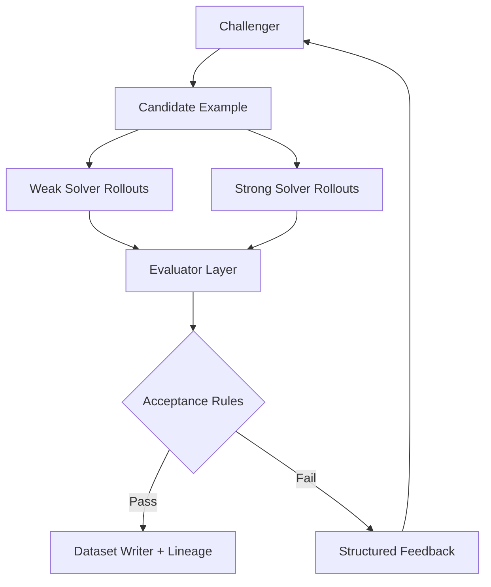

# Autodata Agent Scaffold

A Python-first, production-oriented implementation blueprint inspired by:
- **Autodata: An Agentic Data Scientist to Create High Quality Synthetic Data** (arXiv:2606.25996)
- **Karpathy-style autoresearch loops** (iterative propose-test-critic-improve)

## Architecture

The system is a **multi-role orchestration harness** with strict acceptance criteria:
1. Orchestrator coordinates rounds and budget.
2. Challenger proposes synthetic examples.
3. Weak and strong solvers roll out answers.
4. Judge scores using verifiable and/or rubric evaluators.
5. Quality gates enforce leakage/schema/diversity controls.
6. Storage keeps full traces for accepted and rejected attempts.
7. Meta-optimizer mutates prompts/scaffolds and keeps only improvements.



## First 10 Python Files to Implement

1. `src/autodata_agent/config.py`
2. `src/autodata_agent/schemas.py`
3. `src/autodata_agent/agents/base.py`
4. `src/autodata_agent/agents/model_agent.py`
5. `src/autodata_agent/evaluators/base.py`
6. `src/autodata_agent/evaluators/verifiable.py`
7. `src/autodata_agent/evaluators/rubric.py`
8. `src/autodata_agent/quality/validators.py`
9. `src/autodata_agent/loops/inner_loop.py`
10. `src/autodata_agent/loops/meta_optimizer.py`

## Deploy Anywhere Strategy

- **Container-first** packaging via Docker.
- **GitHub Actions CI/CD** for lint, type, test, security scans, and image publish.
- **Foundry-ready** deployment assets in `deploy/foundry`.
- **Databricks-ready** bundle assets in `deploy/databricks`.
- **Kubernetes-ready** baseline manifests in `deploy/kubernetes`.

## Quick Start

```bash
python -m venv .venv
. .venv/Scripts/activate
pip install -e .[dev]
autodata run-inner-loop --budget 3
```

## Key Challenges You Should Expect

1. **Evaluator reliability drift**: LLM judges are noisy; use repeated rollouts and majority aggregation.
2. **Prompt overfitting**: Meta-optimizer can overfit to benchmark templates; enforce held-out validation.
3. **Leakage and contamination**: Synthetic data can accidentally mirror source benchmarks; add leakage checks and hash-based de-dup.
4. **Cost explosion**: Multi-role, multi-rollout loops multiply token usage quickly; add budget-aware scheduling.
5. **Traceability requirements**: Without full lineage and attempt logs, debugging acceptance failures is hard.
6. **Cheating failure modes**: Candidate generator can exploit rubric loopholes; add adversarial constraints and verifier checks.
